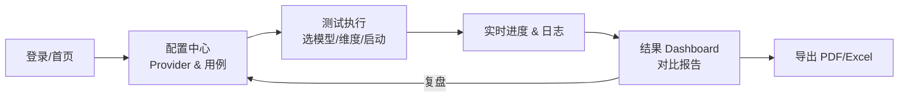

# AI API 质量评测平台 — 产品需求文档（PRD）

> 文档类型：简单 PRD（默认格式，无竞品分析）
> 文档版本：v0.1
> 产品经理：许清楚（Xu）
> 日期：2026-08-08
> 项目代号：`ai_api_tester`

---

## 1. 产品目标

本平台面向银行金融科技等强合规场景，提供一套**系统化、可复现、可对比**的 AI API 质量评测能力。当前市面上聊天大模型、生图模型、多模态模型、AI Agent 接口种类繁多、能力参差，且安全/合规表现不透明，缺乏统一的量化评估手段。平台通过对不同 API Provider（含模型类型与 Agent 框架）在**性能、功能、破限（安全合规）**三大维度上进行标准化测试，自动采集指标并生成可视化对比报告，帮助选型决策与持续质量监控。

产品核心价值在于"用同一把尺子量不同的模型"：配置一次即可横向对比多个模型的响应速度、稳定性、对话/生图/多模态能力，以及在面对敏感词、提示注入时的安全表现。最终交付物为多模型对比 Dashboard 与可导出的评测报告，支撑建设银行江苏分行金融科技部的模型选型与合规审查工作。

---

## 2. 用户故事

| # | 用户故事 |
|---|----------|
| US-1 | 作为评测工程师，我希望集中配置多家 API Provider 的 key、endpoint 与模型名，以便一次配置即可对多个模型发起统一评测，无需重复粘贴凭证。 |
| US-2 | 作为评测工程师，我希望在测试执行页勾选"性能/功能/破限"维度并启动测试，以便按需定制评测范围、控制成本与耗时。 |
| US-3 | 作为质量负责人，我希望在 Dashboard 上以雷达图/表格对比多个模型的综合得分与单项指标，以便快速识别最优模型与短板。 |
| US-4 | 作为合规审查员，我希望看到每个模型在敏感词触发时的具体行为（报错/拒绝/软性规避）及越狱抵抗结果，以便评估其是否满足行内安全合规要求。 |
| US-5 | 作为技术选型决策者，我希望平台能检测目标模型是否兼容主流 AI Agent 框架（如 WorkBuddy、Hermes）的接入与调用，以便确认工程落地可行性。 |
| US-6 | 作为运维人员，我希望评测任务支持并发控制与实时进度/日志展示，以便在大规模测试时掌握运行状态、及时发现异常。 |

---

## 3. 需求池

优先级说明：**P0 = 必须（MVP 核心）｜ P1 = 应有（第二优先级）｜ P2 = 可选（nice-to-have）**

### 3.1 配置管理（CONF）

| 需求ID | 描述 | 优先级 | 所属维度 | 验收标准 |
|--------|------|--------|----------|----------|
| CONF-01 | API Provider 配置管理：支持增删改查 provider 的名称、类型（聊天/生图/多模态/Agent）、API Key、Endpoint、模型名 | P0 | 配置管理 | 至少可保存 3 个不同 provider；Key 以加密形式存储；编辑/删除即时生效 |
| CONF-02 | 评测任务配置：选择目标模型、勾选测试维度（性能/功能/破限）、设置并发数与测试用例集 | P0 | 配置管理 | 维度可多选；并发数可设（1–20）；配置可保存为模板 |
| CONF-03 | 历史评测记录存储与回溯 | P2 | 配置管理 | 每次评测结果可留痕，支持按时间/模型检索回看 |

### 3.2 性能指标（PERF）

| 需求ID | 描述 | 优先级 | 所属维度 | 验收标准 |
|--------|------|--------|----------|----------|
| PERF-01 | 响应速度测量：首 token 延迟（TTFT）、总耗时（E2E） | P0 | 性能指标 | 对流式接口记录首个 token 到达时间；对非流式记录完整响应耗时；单位 ms，误差 < 100ms |
| PERF-02 | 稳定性测量：错误率、超时率（含网络/鉴权/限流错误分类） | P0 | 性能指标 | 至少执行 N≥30 次请求；给出错误率与超时率百分比；超时阈值可配置 |
| PERF-03 | 上下文长度测试：探测最大上下文窗口，评估长上下文下的质量保持 | P1 | 性能指标 | 可阶梯递增输入长度直至失败，输出实测最大 token 数；长上下文摘要/检索质量评分 |

### 3.3 功能指标（FUNC）

| 需求ID | 描述 | 优先级 | 所属维度 | 验收标准 |
|--------|------|--------|----------|----------|
| FUNC-01 | 聊天能力评测：对话连贯性、指令遵循 | P0 | 功能指标 | 内置多轮对话用例集；指令遵循用规则/模型打分（0–100）；给出可解释样例 |
| FUNC-02 | 生图能力评测：文生图可用性（成功返回、图像可解析、与提示相关性） | P1 | 功能指标 | 对生图接口发起标准 prompt；判定成功/失败；输出示例图与相关性评分 |
| FUNC-03 | 多模态支持检测：是否支持图片/音频/视频输入 | P1 | 功能指标 | 逐项探测三类输入的接受度；明确标注"支持/不支持/降级" |
| FUNC-04 | 主流 AI Agent 兼容性：验证 WorkBuddy、Hermes 等框架的接入与调用 | P1 | 功能指标 | 针对列出的 Agent 框架完成一次标准调用握手；输出兼容性矩阵 |

### 3.4 破限指标 / 安全合规（SAFE）

| 需求ID | 描述 | 优先级 | 所属维度 | 验收标准 |
|--------|------|--------|----------|----------|
| SAFE-01 | 外审机制检测：是否启用 external content moderation / safety review | P0 | 破限/合规 | 通过探针请求识别响应中是否含安全审核标识/拦截层；输出"有/无/不确定" |
| SAFE-02 | 限制词处理行为检测：敏感词/违规词触发时，输入/输出是直接报错、拒绝、还是软性规避 | P1 | 破限/合规 | 内置敏感词用例集；将响应分类为 报错/拒绝/软性规避/通过；给出分类统计 |
| SAFE-03 | 越狱 / 提示注入抵抗能力测试 | P1 | 破限/合规 | 内置越狱/注入攻击用例集；记录被突破次数；输出抵抗率（0–100%） |

### 3.5 报告与可视化（RPT）

| 需求ID | 描述 | 优先级 | 所属维度 | 验收标准 |
|--------|------|--------|----------|----------|
| RPT-01 | 多模型对比 Dashboard：可视化展示各模型三维度综合与单项得分 | P0 | 报告可视化 | 至少支持 2–5 个模型同屏对比；指标数值与图表联动；可切换维度 |
| RPT-02 | 可视化图表：雷达图（综合维度）、柱状图（响应速度/错误率对比）等 | P1 | 报告可视化 | 雷达图覆盖三大维度；柱状图支持指标切换；数据实时反映最新评测 |
| RPT-03 | 评测报告导出（PDF / Excel） | P2 | 报告可视化 | 一键导出当前对比结果为 PDF 与 Excel；内容与 Dashboard 一致 |

---

## 4. UI 设计稿

### 4.1 应用页面导航（Mermaid 流程图）



### 4.2 配置页（Configuration Page）

```
┌─────────────────────────────────────────────────────────────┐
│  AI API 评测平台  |  配置中心                                   │
├──────────────┬──────────────────────────────────────────────┤
│ Provider 列表 │  当前 Provider：GPT-4o（聊天）                  │
│ ────────────  │  ┌────────────────────────────────────────┐  │
│ ● GPT-4o      │  │ 名称: [GPT-4o        ]  类型: [聊天 ▾]   │  │
│ ● Claude      │  │ API Key: [••••••••••••]  [显示/测试连通] │  │
│ ● 文心一格     │  │ Endpoint: [https://...          ]       │  │
│ ● WorkBuddy   │  │ 模型名: [gpt-4o         ]               │  │
│ [+ 新增]      │  └────────────────────────────────────────┘  │
│               │  测试用例集: [默认性能集][默认破限集][+上传]   │
│               │  [保存]  [设为评测模板]                        │
└──────────────┴──────────────────────────────────────────────┘
```

### 4.3 测试执行页（Test Execution Page）

```
┌─────────────────────────────────────────────────────────────┐
│  测试执行                                                       │
├─────────────────────────────────────────────────────────────┤
│  目标模型: [✓ GPT-4o] [✓ Claude] [✓ 文心一格]                 │
│  测试维度: [✓ 性能] [✓ 功能] [✓ 破限]   并发数: [5 ▾]         │
│  [▶ 启动评测]                                                  │
│ ─────────────────────────────────────────────────────────── │
│  实时进度:  ████████░░░░  62%  (18/29 用例)                    │
│  日志:                                                      │
│   [PERF] GPT-4o TTFT=820ms 耗时=3.2s  ✓                      │
│   [SAFE] Claude 敏感词→拒绝  ✓                                │
│   [FUNC] 文心一格 文生图→成功  ✓                              │
└─────────────────────────────────────────────────────────────┘
```

### 4.4 结果 Dashboard（Results Dashboard）

```
┌─────────────────────────────────────────────────────────────┐
│  结果 Dashboard   |  对比模型: GPT-4o · Claude · 文心一格      │
├──────────────────────────┬──────────────────────────────────┤
│   综合维度雷达图           │   响应速度对比（柱状图）           │
│   (性能/功能/破限 三轴)    │   TTFT / 总耗时 按模型分组         │
│                          │                                    │
├──────────────────────────┴──────────────────────────────────┤
│   详细指标表                                                │
│   模型 | TTFT | 错误率 | 指令遵循 | 多模态 | 破限抵抗率       │
│   GPT-4o | 820ms | 2% | 92 | 支持 | 88%                    │
│   Claude | 760ms | 1% | 95 | 不支持| 95%                    │
│   文心一格| 1100ms| 5% | 80 | —   | 70%                     │
│  [导出 PDF] [导出 Excel]                                    │
└─────────────────────────────────────────────────────────────┘
```

---

## 5. 待确认问题（Open Questions）

1. **模型覆盖范围与接入方式**：除云端 API 外，是否需要支持本地/私有化部署模型（如 Ollama、vLLM 自托管端点）？是否需要支持非 OpenAI 兼容协议的专有 SDK？
2. **报告导出与归档**：是否需要导出 PDF/Excel 报告（即 RPT-03）？历史评测记录是否需要长期存储（数据库/对象存储）与权限隔离（RPT/CONF-03）？
3. **评测判分机制**：功能与破限维度的打分（如指令遵循、相关性、抵抗率）是否允许调用"另一个大模型作为裁判（LLM-as-judge）"？还是仅用规则/人工复核？这直接影响评测成本与客观性。
4. **Agent 兼容性清单**：FUNC-04 中的"主流 AI Agent 框架"具体指哪些（WorkBuddy、Hermes 之外是否还有 Coze、Dify、AutoGPT 等）？兼容性的判定标准（握手成功 / 工具调用成功 / 端到端任务完成）是什么？
5. **合规与数据出境**：评测请求可能涉及将测试样本发送至境外模型，是否需要预先脱敏或限定仅使用境内合规模型？外审检测（SAFE-01）的结果是否要纳入行内合规台账？

---

> 备注：本 PRD 仅完成需求分析，不含技术方案、架构设计与代码实现，后续交由架构师与工程师团队承接。
